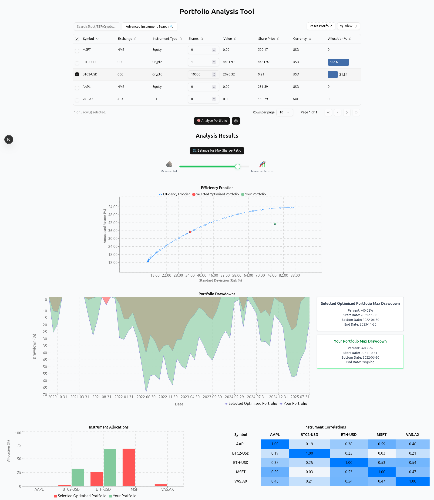
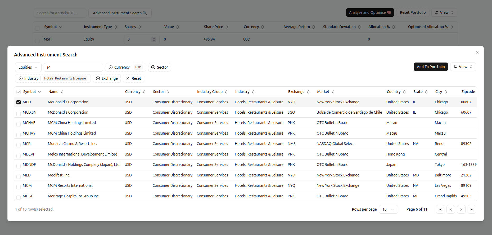

# Portfolio Analysis Tool

A single page webapp for simple analysis and [Markowitz optimisation](https://www.investopedia.com/terms/m/modernportfoliotheory.asp) of ETF and Equity asset portfolios.

This tool is intended to work with the [Financial Modeling Prep](https://financialmodelingprep.com) api and should work with a set of 150,000+ Equities and ETFs globaly.



This tool also includes advanced search functionality to search for instruments across exchanges, currencies, industries etc.



## Run Locally

To run locally, first sign up to FMP and create an API key. Then place this in an .env file in the base directory with the key and value

```
  API_KEY="insert value here"
```

Then simply run the docker compose file with

```bash
  docker compose up --build
```

and connect to `localhost:3000` in your local browser :)

## Running Tests

To test the analysis and optimisation functions run `pytest` in the api directory.

